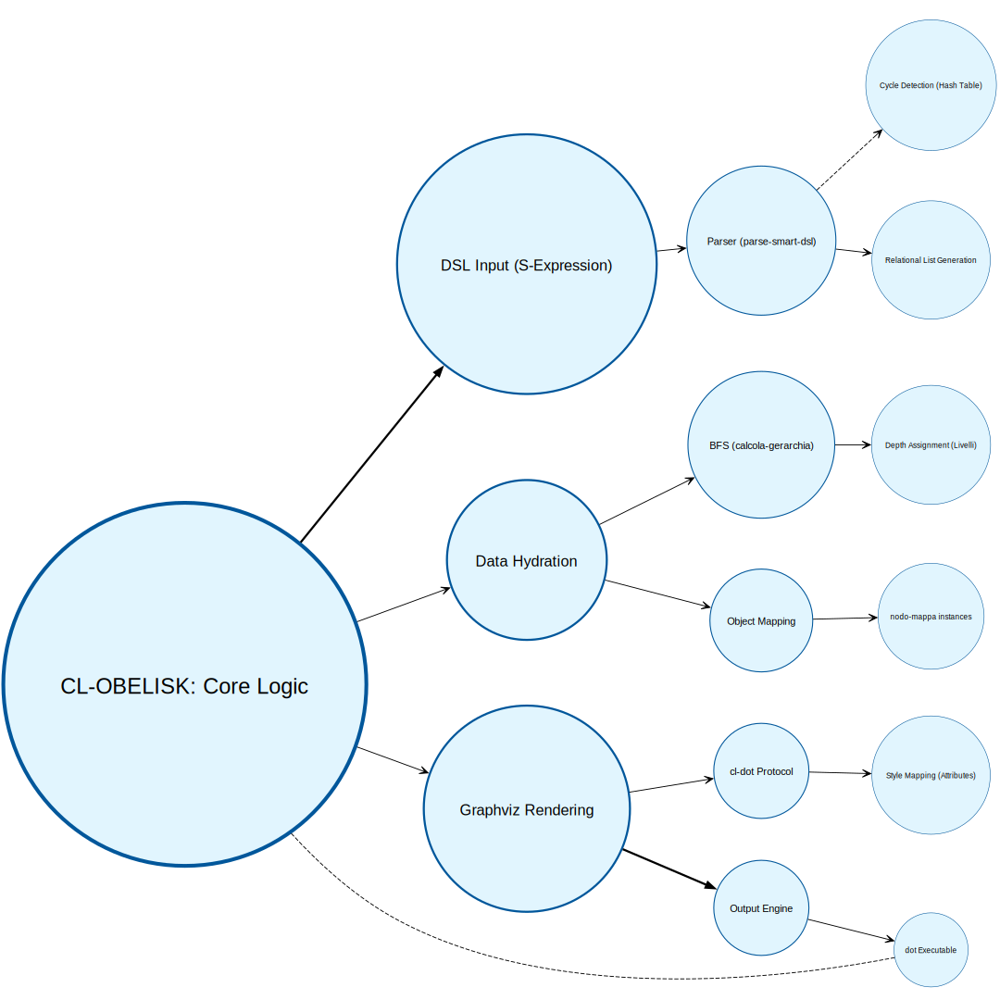

#+author: Nicola Ferru
#+email: ask.nfvblog@outlook.it
#+title: Common Lisp Obelisk

Obelisk è un DSL (*Domain Specific Language*) professionale per Common Lisp, nato come sistema pratico per la scrittura di grafi e mappe mentali o concettuali.

La sua nascita è stata accidentale: deriva dalla necessità di creare mappe concettuali per l'università (esami o tirocini), esigenza che si scontrava violentemente con i software grafici tradizionali. Questi ultimi, infatti, tendono a sprecare spazio sulla carta e a posizionare i nodi in modo poco funzionale. Poiché la mia filosofia è sempre stata quella di ottenere un software affine alla velocità e alla forma delle idee, ecco Obelisk... è un'amara ironia, ma è così.

** Gli stili                                                         :style:
La libreria presenta quattro stili, pensati per compiti distinti:

- ~:tecnico~: un'organizzazione minimale per uso tecnico-scientifico, composta da linee dritte, nodi rettangolari e un grigio sobrio.
- ~:umanistico~: studiato per concetti astratti; utilizza una struttura a "palloncini" per facilitare la comprensione.
- ~:scientifico~: perfetto per il mapping matematico, senza nodi senza bordi e linee pulite per le relazioni.
- ~:boheme~: nato dal desiderio di qualcosa di non convenzionale. È un estro creativo personale: non vuole piacere né essere adorato, esiste semplicemente perché doveva esistere.
- ~:grafo~: uno stile moderno e simmetrico che utilizza nodi circolari su sfondo azzurro tenue. È ideale per sistemi chiusi, cicli biologici o processi logici dove ogni nodo ha lo stesso peso visivo.

Altri stili potrebbero essere aggiunti in futuro.

** Formati supportati

| *:formato*             | *:carta*            | *:orientamento*              | *:martgini*   |
|------------------------+---------------------+------------------------------+---------------|
| ~:png~, ~:pdf~, ~:svg~ | ~:a2~, ~:a3~, ~:a4~ | ~:orizzontale~, ~:verticale~ | es. *2 (2cm)* |

Di =default=, Obelisk ragiona in verticale, l'orientamento è una delle opzioni parametriche.

** Requisiti                                                           :req:
Per funzionare, Obelisk richiede che siano installati nel sistema:

- *Graphviz* (il comando =dot= deve essere disponibile nel ~PATH~).
- *Common Lisp* (testato su SBCL).
- *Quicklisp* (il gestore pacchetti per cui è stato concepito).

** Installazione                                             :installazione:
Clona il repository nella tua cartella ~local-projects~:

#+begin_src shell
  cd ~/quicklisp/local-projects/
  git clone https://github.com/tuo-username/cl-obelisk.git
#+end_src

Carica la libreria con:

#+begin_src lisp
  (ql:quickload :cl-obelisk)
#+end_src
*** Non funziona?
Se Quicklisp non dovesse trovare il sistema, prova a sincronizzare manualmente la directory del progetto nel registro di *ASDF*:

#+begin_src lisp
  (push (uiop:getcwd) asdf:*central-registry*)
#+end_src

In molti casi, questo risolve i problemi di pacchetto non trovato permettendo a =(ql:quickload :cl-obelisk)= di procedere correttamente.

** Esempio Rapido (DSL)                                                :dsl:
Ecco come creare una mappa concettuale con cicli e gerarchie marcate:

#+srcname: Esempio di DSL
#+begin_src lisp
  (cl-obelisk:genera-da-dsl "mia_mappa" 
  			  '("Obelisk"
  			    (:normal "Creativo"
  			     (:normal "Senza Regole" "Obelisk")) ;; se il nodo esiste fa un collegamento 
  			    (:importante "Semplice" "Veloce"))
  			  :carta :a4
  			  :margine 2
  			  :formato :pdf
  			  :stile :umanistico
  			  )
#+end_src

*** Rappresentazione grafica
Per rendere più semplice la comprensione a tutti come esso funzioni _CL-obelisk_:

#+name: Schema funzionale

Non è matematicamente semplice, ma quanto meno è veloce. Dalla versione 0.1.1 supporta pure i contenitori "cluster"!

** Appendici logiche
- [[./docs/pag/matematica.org][Documentazione Algoritmica]]: Racchiude della logica matematica del software nei suoi aspetti.
- [[./docs/pag/istruzioni.org][Documentazione del Parser Smart-DSL]]: Raccolta dei parametri del del Obelisk Smart DSL.
- [[./docs/pag/contenitori.org][Documentazione Tecnica: Gestione dei Contenitori (Cluster)]]: Questa è una parte fondamentale per poter isolare il grafico a compartimenti stagni (utile ad esempio, per infrastruttura e gestione aziendale).
- [[./docs/pag/demo.org][Esempi di utilizzo]]: sono presenti alcuni demo di utilizzo del programma, in modo ordinato e pratico.
  
** Licenza
Distribuito sotto licenza *GPLv3*.
