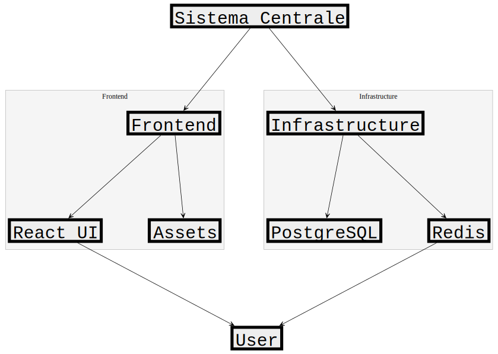
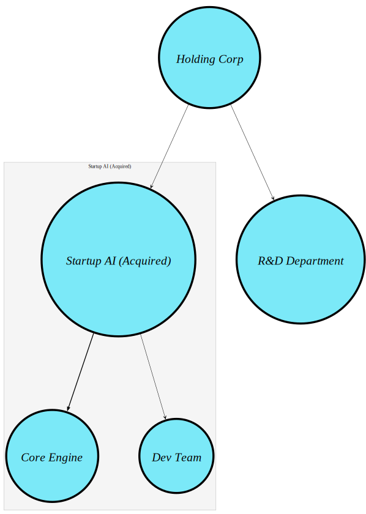
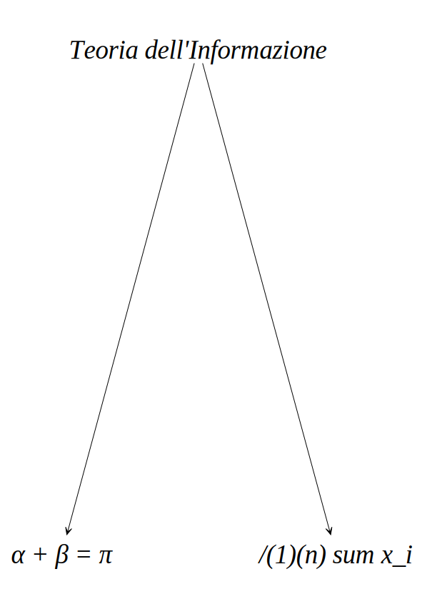

#+TITLE: Demo e Casi d'Uso: cl-obelisk
#+PROPERTY: header-args:lisp :package :cl-obelisk

* Introduzione
Questo documento contiene esempi pratici del DSL Obelisk, progettati per testare la resa grafica e la logica di compartimentazione.

* Infrastruttura IT (Esempio Cluster e Ponti)
In questo scenario simuliamo un'architettura a microservizi. Utilizziamo i contenitori per isolare i domini e i ponti per le interazioni cross-dominio.

#+begin_src lisp
  (genera-da-dsl "demo-architettura"
                   '("Sistema Centrale"
                     (:contenitore "Infrastructure"
    			       "PostgreSQL"
    			       "Redis")
                     (:contenitore "Frontend"
    			       "React UI"
    			       "Assets")
                     (:ponte "Redis" "User") 
                     (:ponte "React UI" "User"))
                   :stile :tecnico
                   :carta :a4-or)
#+end_src

*Output restituito:*

* Simulazione Aziendale: Acquisizione Startup
Qui testiamo la capacità di Obelisk di gestire la gerarchia durante un'integrazione. Notare come lo stile
cambia per evidenziare l'entità acquisita.

#+begin_src lisp
  (genera-da-dsl "demo-m-and-a"
                 '("Holding Corp"
                   (:normal "R&D Department")
                   (:contenitore "Startup AI (Acquired)"
  			       (:importante "Core Engine")
  			       "Dev Team"))
                 :stile :grafo
                 :formato :pdf)
#+end_src
*Output restituito:*

* Rendering Matematico e Scientifico
Test della funzione ~render-lisp-math~ per la conversione di espressioni LaTeX in etichette leggibili.

#+begin_src lisp
  (genera-da-dsl "demo-math"
                 '("Teoria dell'Informazione"
                   "$\\alpha + \\beta = \\pi$"
                   "$\\frac{1}{n} \\sum x_i$")
                 :stile :scientifico)
#+end_src
*Output restituito:*

